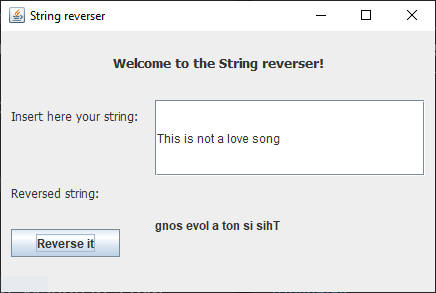

# Short Description:
This is a simple GUI made in JavaFX. The user can insert any word or sentence and it will be reversed.

# Getting Started as a developer:
git clone or pull the project. 
```sh 
git clone
```

# Screenshots:


